# README.md for Figures Created on 2020/05/23 at 15:51.48 PST.

## Notes

(Add Notes Here.)

## Parameters

```py
params = {
	'Initial Muscle Length' : [0.11019999999999999, 0.13735],
	'Initial Tendon Tensions' : [array([174.14337021, 385.68326148]), array([206.144374  , 456.55734354]), array([238.14537778, 527.43142559]), array([270.14638157, 598.30550765]), array([302.14738535, 669.17958971]), array([334.14838914, 740.05367177]), array([366.14939292, 810.92775383]), array([398.15039671, 881.80183588]), array([430.15140049, 952.67591794]), array([ 462.15240428, 1023.55      ])]
}
```

## Figures

<p align="center">
	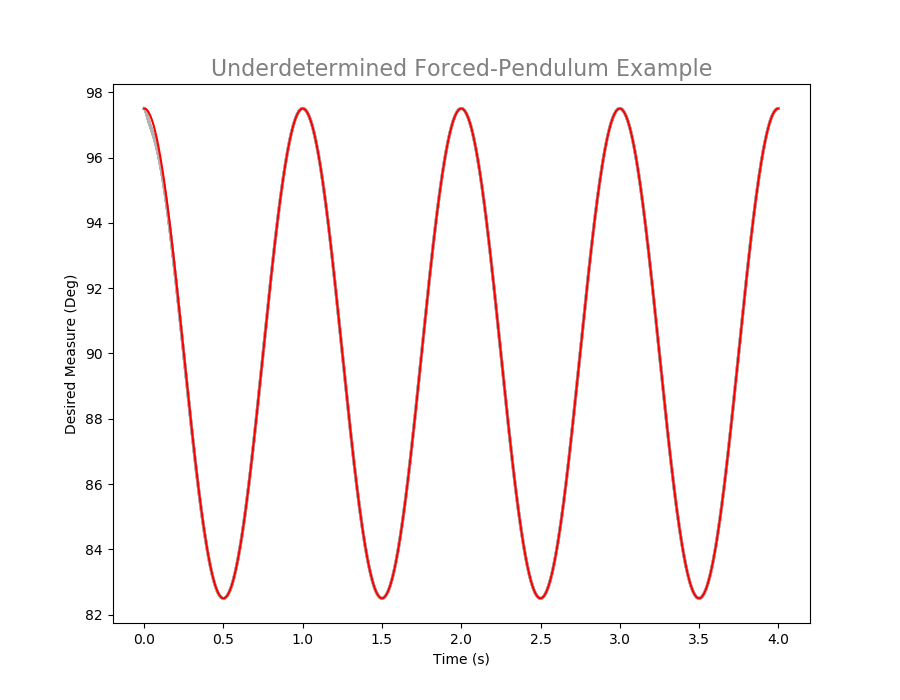</br>
	<small>Figure 1: Caption for 1DOF_2DOA_01-01.png.</small>
</p>
</br>
</br>

<p align="center">
	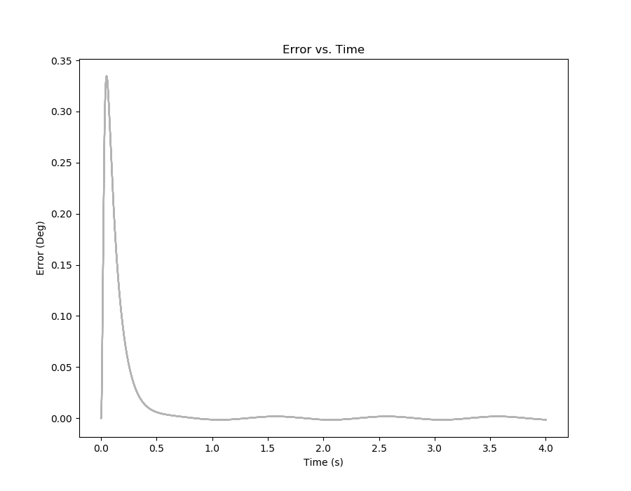</br>
	<small>Figure 2: Caption for 1DOF_2DOA_01-02.png.</small>
</p>
</br>
</br>

<p align="center">
	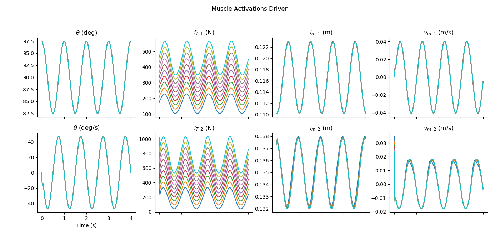</br>
	<small>Figure 3: Caption for 1DOF_2DOA_01-03.png.</small>
</p>
</br>
</br>

<p align="center">
	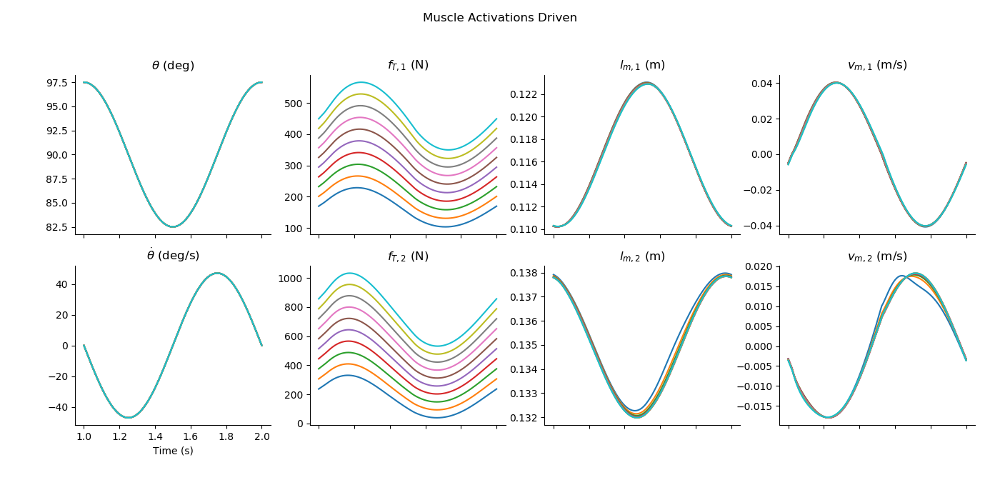</br>
	<small>Figure 4: Caption for 1DOF_2DOA_01-04.png.</small>
</p>
</br>
</br>

<p align="center">
	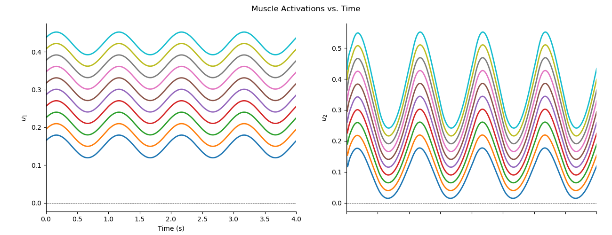</br>
	<small>Figure 5: Caption for 1DOF_2DOA_01-05.png.</small>
</p>
</br>
</br>

<p align="center">
	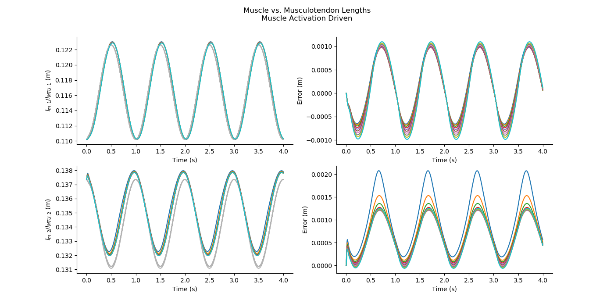</br>
	<small>Figure 6: Caption for 1DOF_2DOA_01-06.png.</small>
</p>
</br>
</br>

<p align="center">
	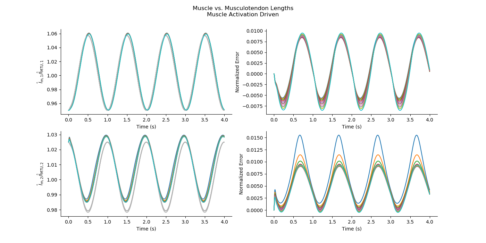</br>
	<small>Figure 7: Caption for 1DOF_2DOA_01-07.png.</small>
</p>
</br>
</br>

<p align="center">
	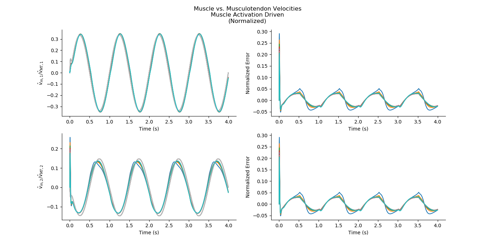</br>
	<small>Figure 8: Caption for 1DOF_2DOA_01-08.png.</small>
</p>
</br>
</br>


<p align="center">
	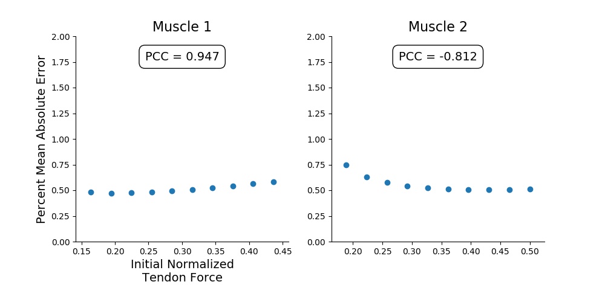</br>
	<small>Figure 9: Caption for 1DOF_2DOA_01-13.png.</small>
</p>
</br>
</br>


# Appended on 2020/05/23 at 15:56.26 PST.

## Notes

(Add Notes Here.)

## Parameters

```py
params = {
	'Initial Muscle Length' : [0.11019999999999999, 0.13735],
	'Initial Tendon Tensions' : [array([174.14337021, 385.68326148]), array([206.144374  , 456.55734354]), array([238.14537778, 527.43142559]), array([270.14638157, 598.30550765]), array([302.14738535, 669.17958971]), array([334.14838914, 740.05367177]), array([366.14939292, 810.92775383]), array([398.15039671, 881.80183588]), array([430.15140049, 952.67591794]), array([ 462.15240428, 1023.55      ])]
}
```

## Figures

<p align="center">
	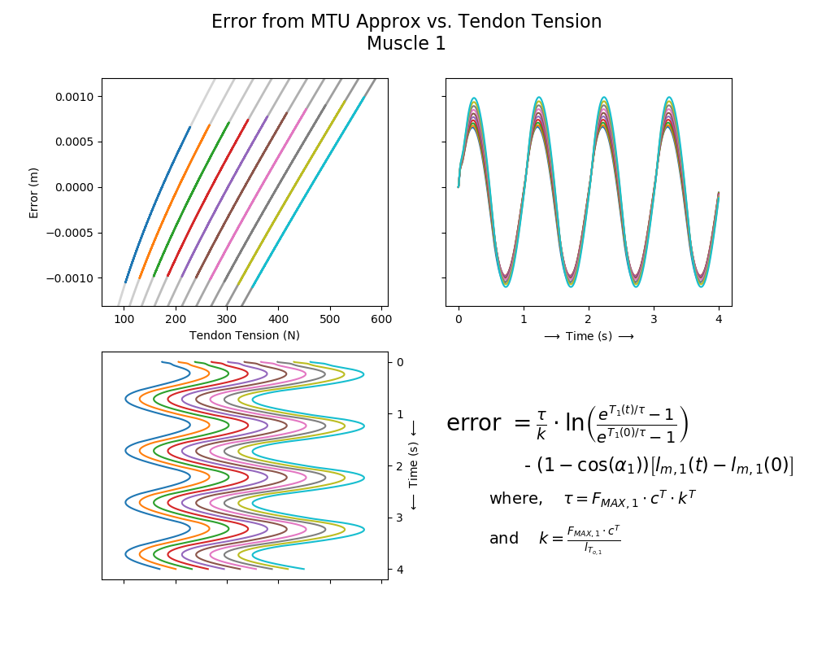</br>
	<small>Figure 10: Caption for 1DOF_2DOA_02-01.png.</small>
</p>
</br>
</br>

<p align="center">
	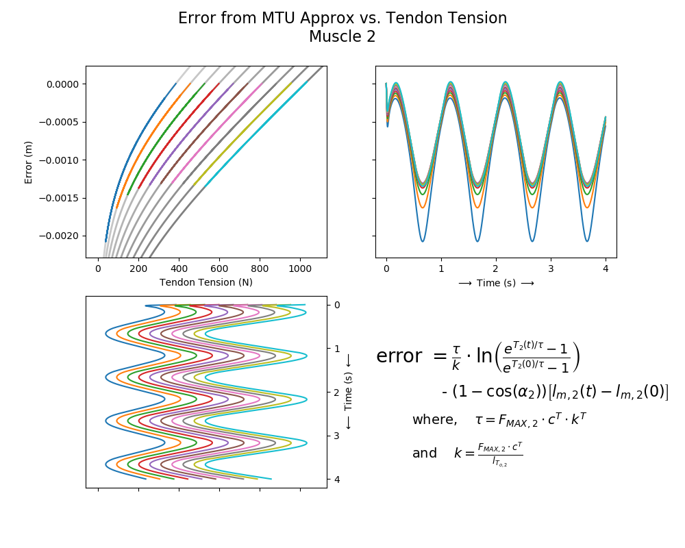</br>
	<small>Figure 11: Caption for 1DOF_2DOA_02-02.png.</small>
</p>
</br>
</br>
