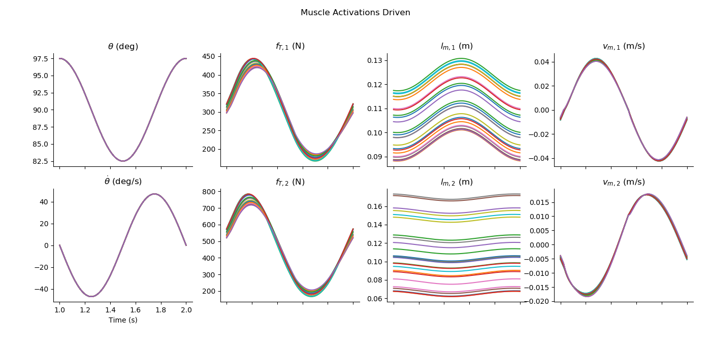

# README.md for Figures Created on 2020/05/23 at 18:32.49 PST.

## Notes

(Add Notes Here.)

## Parameters

```py
params = {
	'Initial Muscle Lengths' : [array([0.09893044, 0.06757343])],
	'Initial Tendon Tensions' : [array([[334.14838914],
       [740.05367177]])]
}
```

## Figures

<p align="center">
	</br>
	<small>Figure 1: Caption for 1DOF_2DOA_01-01.png.</small>
</p>
</br>
</br>

<p align="center">
	</br>
	<small>Figure 2: Caption for 1DOF_2DOA_01-02.png.</small>
</p>
</br>
</br>

<p align="center">
	</br>
	<small>Figure 3: Caption for 1DOF_2DOA_01-03.png.</small>
</p>
</br>
</br>

<p align="center">
	</br>
	<small>Figure 4: Caption for 1DOF_2DOA_01-04.png.</small>
</p>
</br>
</br>

<p align="center">
	</br>
	<small>Figure 5: Caption for 1DOF_2DOA_01-05.png.</small>
</p>
</br>
</br>

<p align="center">
	</br>
	<small>Figure 6: Caption for 1DOF_2DOA_01-06.png.</small>
</p>
</br>
</br>

<p align="center">
	</br>
	<small>Figure 7: Caption for 1DOF_2DOA_01-07.png.</small>
</p>
</br>
</br>

<p align="center">
	</br>
	<small>Figure 8: Caption for 1DOF_2DOA_01-08.png.</small>
</p>
</br>
</br>


# Appended on 2020/05/23 at 18:57.22 PST.

## Notes

(Add Notes Here.)

## Parameters

```py
params = {
	'Initial Muscle Lengths' : [array([0.09893044, 0.06757343])],
	'Initial Tendon Tensions' : [array([[334.14838914],
       [740.05367177]])]
}
```

## Figures

<p align="center">
	</br>
	<small>Figure 9: Caption for 1DOF_2DOA_02-01.png.</small>
</p>
</br>
</br>

<p align="center">
	</br>
	<small>Figure 10: Caption for 1DOF_2DOA_02-02.png.</small>
</p>
</br>
</br>

<p align="center">
	</br>
	<small>Figure 11: Caption for 1DOF_2DOA_02-03.png.</small>
</p>
</br>
</br>
